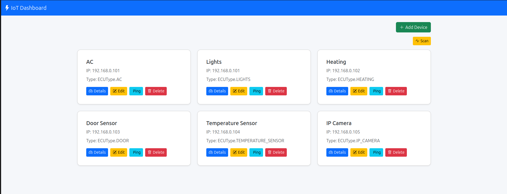
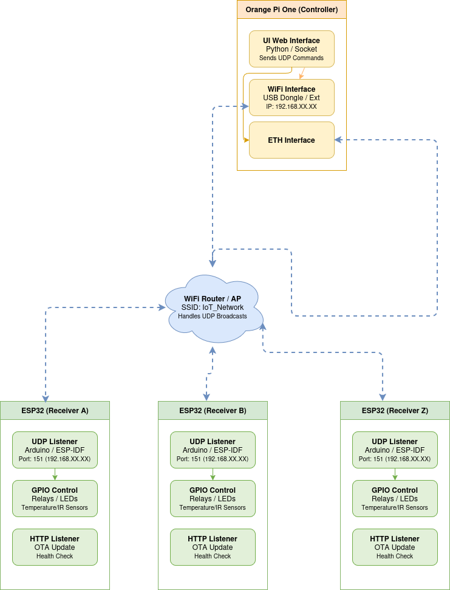

# IoT Система за Домашна Автоматизация

> Система за домашна автоматизация, базирана на **Orange Pi One** и **ESP32**, разработена с фокус върху бързодействие и независимост от облачни услуги.

## Обща информация

Настоящият проект представлява разработка на интелигентна IoT система за домашна автоматизация, предназначена за наблюдение и управление на различни устройства в домашна среда.

Системата използва **Orange Pi One** като централен контролер и множество **ESP32** базирани крайни устройства, които събират данни от сензори и управляват изпълнителни механизми. Комуникацията между отделните компоненти се осъществява чрез локална Wi-Fi мрежа и UDP протокол, което осигурява ниска латентност и висока производителност.

Основната идея на проекта е изграждането на достъпна, разширяема и лесна за поддръжка платформа, която не зависи от външни облачни услуги и предоставя пълен контрол върху данните и устройствата.

---
## Архитектура на системата

Системата е изградена от два основни слоя:

### Централен контролер

**Orange Pi One** изпълнява ролята на локален сървър и отговаря за:

* управление на устройствата;
* обработка на получените данни;
* изпълнение на автоматизации;
* съхранение на конфигурации;
* предоставяне на уеб интерфейс за потребителя.

### IoT устройства

Крайните устройства са реализирани чрез **ESP32** микроконтролери, които:

* събират информация от свързани сензори;
* управляват изпълнителни механизми;
* комуникират с централния контролер;
* изпълняват локални команди и задачи.

---

## Използвани технологии

### Хардуер

* Orange Pi One
* ESP32
* DHT22 температурен и влажен сензор
* Инфрачервен предавател KY-005
* Инфрачервен приемник HX1838
* Релеен модул

### Софтуер

* Python
* Flask
* SQLAlchemy
* SQLite
* C/C++
* Arduino Framework
* WiFiUDP

---

## Комуникация

Обменът на данни между устройствата се осъществява чрез:

* **Wi-Fi мрежа**
* **UDP протокол**

Изборът на UDP е обусловен от необходимостта от:

* минимално закъснение;
* ниско натоварване на микроконтролерите;
* бърза обработка на събития;
* ефективен обмен на телеметрични данни.

---

## Реализирани функционалности

### Мониторинг на околната среда

* измерване на температура;
* измерване на влажност;
* визуализация на текущите стойности.

### Управление на устройства

* управление на климатична система чрез инфрачервени команди;
* управление на електрически устройства чрез релета;
* дистанционно изпращане на управляващи команди.

### Управление на системата

* автоматично откриване на устройства в  LAN локалната мрежа;
* централизирано управление чрез уеб интерфейс;
* съхранение на настройки и конфигурации;
* възможност за добавяне на нови устройства.

---